# Struktur-Data-dan-OOP---Class-Diagram

## Sistem Manajemen Event
### Deskripsi Kasus:
Pada saat ini, terdapat banyak jenis hiburan yang diminati banyak orang sebagai tempat untuk beristirahat sejenak dari kesibukan dunia. Jenis hiburan tersebut mencakup konser, festival, maupun fanmeeting yang saat ini semakin diminati kalangan muda. Dalam sebuah event, terdapat hal-hal yang penting untuk dikelola, seperti informasi event (nama, tanggal, lokasi), pembelian tiket, dan notifikasi status pembayaran. Untuk itu, Sistem Manajemen Event ini sangat penting digunakan dalam mengelola event tersebut.
OOP dapat:
1. Menyimpan informasi setiap event: nama, tanggal pelaksanaan, lokasi, kapasitas.
2. Memberitahu memngenai informasi harga tiket berdasarkan kategori VIP dan reguler.
3. Memberikan notifikasi untuk aktivitas pembayaran dan lokasi event.

### Class Diagram

```mermaid
classDiagram
direction TB
    class Event {
	    #nama : String
	    #tanggal : String
	    #lokasi : String
	    -kapasitas : int
	    +Event(nama: String, tanggal: String, lokasi : String, kapasitas: int)
	    +TampilTiket(infoTiket: String) void
	    +notif(pesan: String, this.nama:String) void
    }

    class Konser {
	    #penyanyi : String
	    +Konser(nama: String, tanggal: String, lokasi: String, kapasitas: int, penyanyi: String)
	    +TampilInfo() void
    }

    class Festival {
	    #jenis : String
	    +Festival(nama: String, tanggal: String, lokasi: String, kapasitas: int, jenis: String)
	    +TampilInfo() void
    }

    class FanMeeting {
	    #artis : String
	    +FanMeeting(nama: String, tanggal: String, lokasi: String, kapasitas: int, artis: String)
	    +TampilInfo() void
    }

    class Tiket {
	    +TampilTiket(infoTiket: String) void
    }

    class Notifikasi {
	    +notif(pesan: String, nama: String) void
    }

    class TiketVIP {
	    +TampilTiket(infoTiket: String) void
    }

    class TiketReguler {
	    +TampilTiket(infoTiket: String) void
    }

    class NotifikasiPembayaran {
	    +notif(pesan: String, nama: String) void
    }

    class NotifikasiLokasi {
	    +notif(pesan: String, nama: String) void
    }

	class NotifikasiPengingat {
		+notif(pesan: String, nama: String) void
	}

	<<Abstract>> Event
	<<Interface>> Tiket
	<<Interface>> Notifikasi

    Event <|-- Konser
    Event <|-- Festival
    Event <|-- FanMeeting
    Event --> Tiket : menggunakan
    Event --> Notifikasi : menggunakan
    Tiket <|.. TiketVIP
    Tiket <|.. TiketReguler
    Notifikasi <|.. NotifikasiPembayaran
    Notifikasi <|.. NotifikasiLokasi
	Notifikasi <|.. NotifikasiPengingat

	class Event
	class Konser
	class Festival
	class FanMeeting
	class Tiket
	class Notifikasi
	class TiketVIP
	class TiketReguler
	class NotifikasiPembayaran
	class NotifikasiLokasi
	class NotifikasiPengingat
```


**Tampilan Class Diagram**


### Kode Program Java

```java code
public class App {
    public static void main(String[] args) {

        Konser Event1 = new Konser("JAZZ Fest", "10 April 2026", "Jakarta", 100000, "Nailong");
        Event1.TampilInfo();
        Event1.tiketVIP(
                "1. VIP Standing: Rp1.000.000\n2. VIP Seating: Rp1.200.000\n(Harga sudah termasuk snack dan LED Wristband.)");
        Event1.notifBayar("Silakan mengunduh E-ticket dengan kode: [290913]");
        Event1.notifLokasi("Gelora Bung Karno");

        FanMeeting Event2 = new FanMeeting("Nailong Exhibition", "20 Oktober 2026", "Surabaya", 2000, "Nailong");
        Event2.TampilInfo();
        Event2.tiketReguler(
                "1. Reguler A: Rp100.000 - Durasi 10 menit\n2. Reguler B: Rp90.000 - Durasi 7 menit\n3. Reguler C: Rp80.000 - Durasi 5 menit");
        Event2.notifBayar("Silakan unduh tiket Anda di halaman website: nailongglobal.com");
        Event2.notifLokasi("Tenis Indoor Senayan");
        Event2.notifPengingat("Silakan datang ke lokasi tepat waktu dan memberikan tiket ke petugas di pintu masuk.");
    }
}

abstract class Event {
    protected String nama;
    protected String tanggal;
    protected String lokasi;
    protected int kapasitas;
    protected NotifikasiPembayaran notifBayar = new NotifikasiPembayaran();
    protected NotifikasiLokasi notifLokasi = new NotifikasiLokasi();
    protected NotifikasiPengingat notifPengingat = new NotifikasiPengingat();
    protected TiketVIP tiketVIP = new TiketVIP();
    protected TiketReguler tiketReguler = new TiketReguler();

    // CONSTRUCTOR
    public Event(String nama, String tanggal, String lokasi, int kapasitas) {
        this.nama = nama;
        this.tanggal = tanggal;
        this.lokasi = lokasi;
        this.kapasitas = kapasitas;

    }

    abstract void TampilInfo();

    public int getKapasitas() {
        return kapasitas;
    }

    public void setKapasitas(int kapasitasBaru) {
        this.kapasitas = kapasitasBaru;
    }

    public void notifBayar(String pesan) {
        notifBayar.notif(pesan, this.nama);
    }

    public void notifLokasi(String pesan) {
        notifLokasi.notif(pesan, this.nama);
    }

    public void notifPengingat(String pesan) {
        notifPengingat.notif(pesan, this.nama);
    }

    public void tiketVIP(String infoTiket) {
        tiketVIP.TampilTiket(infoTiket);
    }

    public void tiketReguler(String infoTiket) {
        tiketReguler.TampilTiket(infoTiket);
    }
}

class Konser extends Event {
    private String penyanyi;

    // Constructor
    public Konser(String nama, String tanggal, String lokasi, int kapasitas, String penyanyi) {
        super(nama, tanggal, lokasi, kapasitas);
        this.penyanyi = penyanyi;
    }

    @Override
    void TampilInfo() {
        System.out.println("\n========== INFO KONSER ==========");
        System.out.println("Nama konser         : " + nama);
        System.out.println("Penyanyi            : " + penyanyi);
        System.out.println("Tanggal pelaksanaan : " + tanggal);
        System.out.println("Lokasi              : " + lokasi);
        System.out.println("Kapasitas           : " + kapasitas + " orang");
    }
}

class Festival extends Event {
    private String jenis;

    // Constructor
    public Festival(String nama, String tanggal, String lokasi, int kapasitas, String jenis) {
        super(nama, tanggal, lokasi, kapasitas);
        this.jenis = jenis;
    }

    @Override
    void TampilInfo() {
        System.out.println("========== INFO FESTIVAL ==========");
        System.out.println("Nama festival       : " + nama);
        System.out.println("Jenis festival      : " + jenis);
        System.out.println("Tanggal pelaksanaan : " + tanggal);
        System.out.println("Lokasi              : " + lokasi);
        System.out.println("Kapasitas           : " + kapasitas + " orang");
    }
}

class FanMeeting extends Event {
    private String artis;

    // Constructor
    public FanMeeting(String nama, String tanggal, String lokasi, int kapasitas, String artis) {
        super(nama, tanggal, lokasi, kapasitas);
        this.artis = artis;
    }

    @Override
    void TampilInfo() {
        System.out.println("\n========== INFO FESTIVAL ==========");
        System.out.println("Nama Acara          : " + nama);
        System.out.println("Nama Artis          : " + artis);
        System.out.println("Tanggal Pelaksanaan : " + tanggal);
        System.out.println("Lokasi              : " + lokasi);
        System.out.println("Kapasitas           : " + kapasitas + " orang");
    }
}

interface Tiket {
    void TampilTiket(String infoTiket);
}

class TiketVIP implements Tiket {
    @Override
    public void TampilTiket(String infoTiket) {
        System.out.println("\n===== Info Tiket VIP =====\n" + infoTiket);
    }
}

class TiketReguler implements Tiket {
    @Override
    public void TampilTiket(String infoTiket) {
        System.out.println("\n===== Info Tiket Regular =====\n" + infoTiket);
    }
}

interface Notifikasi {
    void notif(String pesan, String nama);
}

class NotifikasiPembayaran implements Notifikasi {
    @Override
    public void notif(String pesan, String nama) {
        System.out.println("\n[Pemberitahuan Event " + nama + "]");
        System.out.println("Pembayaran berhasil! " + pesan);
    }
}

class NotifikasiLokasi implements Notifikasi {
    @Override
    public void notif(String pesan, String nama) {
        System.out.println("\n[Pemberitahuan Lokasi Event " + nama + "]");
        System.out.println("Lokasi event: " + pesan);
    }
}

class NotifikasiPengingat implements Notifikasi {
    @Override
    public void notif(String pesan, String nama) {
        System.out.println("\n[Pemberitahuan Event " + nama + "]");
        System.out.println(
                "Halo! Event " + nama + " akan dilaksanakan 1 jam lagi!\n" + pesan + "\nHave a nice journey!\n");
    }
}
```

### Output Kode Java


### Penjelasan Prinsip OOP yang Diterapkan
1. Abstraction
Abstract class `Event` hanya menampilkan yang penting saja. Implementasinya berada di subclass `Konser`, `Festival`, dan `FanMeeting`.
```java
abstract class Event {
    protected String nama;
    protected String tanggal;
    protected String lokasi;
    protected int kapasitas;
    protected NotifikasiPembayaran notifBayar = new NotifikasiPembayaran();
    protected NotifikasiLokasi notifLokasi = new NotifikasiLokasi();
    protected NotifikasiPengingat notifPengingat = new NotifikasiPengingat();
    protected TiketVIP tiketVIP = new TiketVIP();
    protected TiketReguler tiketReguler = new TiketReguler();

    // CONSTRUCTOR
    public Event(String nama, String tanggal, String lokasi, int kapasitas) {
        this.nama = nama;
        this.tanggal = tanggal;
        this.lokasi = lokasi;
        this.kapasitas = kapasitas;

    }

    abstract void TampilInfo();

    public int getKapasitas() {
        return kapasitas;
    }

    public void setKapasitas(int kapasitasBaru) {
        this.kapasitas = kapasitasBaru;
    }

    public void notifBayar(String pesan) {
        notifBayar.notif(pesan, this.nama);
    }

    public void notifLokasi(String pesan) {
        notifLokasi.notif(pesan, this.nama);
    }

    public void notifPengingat(String pesan) {
        notifPengingat.notif(pesan, this.nama);
    }

    public void tiketVIP(String infoTiket) {
        tiketVIP.TampilTiket(infoTiket);
    }

    public void tiketReguler(String infoTiket) {
        tiketReguler.TampilTiket(infoTiket);
    }
}
```

2. Encapsulation
Variabel yang bersifat `protected`, yaitu `nama`, `tanggal`, `lokasi`, dan `kapasitas` hanya bisa diakses melalui method `getter` dan `setter` di kelas turunan.
```java
public int getKapasitas() {
        return kapasitas;
    }

    public void setKapasitas(int kapasitasBaru) {
        this.kapasitas = kapasitasBaru;
    }
```

3. Inheritance
Pada program ini, subclass `Konser`, `Festival`, dan `FanMeeting` mewarisi parent class `Event` dengan implementasi yang berbeda setiap subclassnya.
- Subclass `Konser` 
```java
class Konser extends Event {
    private String penyanyi;

    // Constructor
    public Konser(String nama, String tanggal, String lokasi, int kapasitas, String penyanyi) {
        super(nama, tanggal, lokasi, kapasitas);
        this.penyanyi = penyanyi;
    }
```

- Subclass Festival
```java
class Festival extends Event {
    private String jenis;

    // Constructor
    public Festival(String nama, String tanggal, String lokasi, int kapasitas, String jenis) {
        super(nama, tanggal, lokasi, kapasitas);
        this.jenis = jenis;
    }
```

4. Polymorphism
Untuk fungsi `TampilInfo()`, tiap subclass memiliki implementasi yang berbeda-beda.
- Subclass `Konser`
```java
@Override
    void TampilInfo() {
        System.out.println("\n========== INFO KONSER ==========");
        System.out.println("Nama konser         : " + nama);
        System.out.println("Penyanyi            : " + penyanyi);
        System.out.println("Tanggal pelaksanaan : " + tanggal);
        System.out.println("Lokasi              : " + lokasi);
        System.out.println("Kapasitas           : " + kapasitas + " orang");
    }
```

- Subclass `Festival`
```java
@Override
    void TampilInfo() {
        System.out.println("========== INFO FESTIVAL ==========");
        System.out.println("Nama festival       : " + nama);
        System.out.println("Jenis festival      : " + jenis);
        System.out.println("Tanggal pelaksanaan : " + tanggal);
        System.out.println("Lokasi              : " + lokasi);
        System.out.println("Kapasitas           : " + kapasitas + " orang");
    }
```

- Subclass `FanMeeting`
```java
@Override
    void TampilInfo() {
        System.out.println("\n========== INFO FESTIVAL ==========");
        System.out.println("Nama Acara          : " + nama);
        System.out.println("Nama Artis          : " + artis);
        System.out.println("Tanggal Pelaksanaan : " + tanggal);
        System.out.println("Lokasi              : " + lokasi);
        System.out.println("Kapasitas           : " + kapasitas + " orang");
    }
```

5. Interface
Interface seperti `Tiket` dan `Notifikasi` dapat diimplementasikan dengan cara yang berbeda.
```java
interface Tiket {
    void TampilTiket(String infoTiket);
}

class TiketVIP implements Tiket {
    @Override
    public void TampilTiket(String infoTiket) {
        System.out.println("\n===== Info Tiket VIP =====\n" + infoTiket);
    }
}

class TiketReguler implements Tiket {
    @Override
    public void TampilTiket(String infoTiket) {
        System.out.println("\n===== Info Tiket Regular =====\n" + infoTiket);
    }
}
```

### Keunikan Program
- Program ini dapat memberikan informasi tiket berdasarkan kategori yang berbeda.
- Dapat memberikan notifikasi pengingat 1 jam sebelum event dimulai dan memberitahu informasi mengenai tiket.
- Memberitahu detail lokasi kepada pembeli setelah berhasil melakukan pembelian tiket.

Program ini dapat dikembangkan lagi dengan mmenambah notifikasi pengisian feedback setelah event selesai. 
