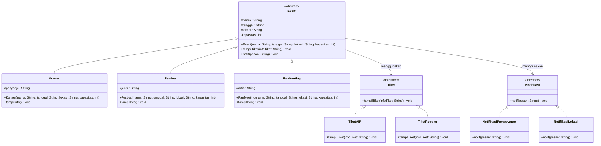

# Struktur-Data-dan-OOP---Class-Diagram

## Sistem Manajemen Event
### Deskripsi Kasus:
Pada saat ini, terdapat banyak jenis hiburan yang diminati banyak orang sebagai tempat untuk beristirahat sejenak dari kesibukan dunia. Jenis hiburan tersebut mencakup konser, festival, maupun fanmeeting yang saat ini semakin diminati kalangan muda. Dalam sebuah event, terdapat hal-hal yang penting untuk dikelola, seperti informasi event (nama, tanggal, lokasi), pembelian tiket, dan notifikasi status pembayaran. Untuk itu, Sistem Manajemen Event ini sangat penting digunakan dalam mengelola event tersebut.
OOP dapat:
1. Menyimpan informasi setiap event: nama, tanggal pelaksanaan, lokasi, kapasitas.
2. Memberitahu memngenai informasi harga tiket berdasarkan kategori VIP dan reguler.
3. Memberikan notifikasi untuk aktivitas pembayaran dan lokasi event.

### Class Diagram




### Kode Program Java

```java code
public class App {
    public static void main(String[] args) {

        Konser Events = new Konser("JAZZ Fest", "10 April 2026", "Jakarta", 100000, "Nailong");
        Events.tampilInfo();
        Events.tiketVIP(
                "1. VIP Standing: Rp1.000.000\n2. VIP Seating: Rp1.200.000\n(Harga sudah termasuk snack dan LED Wristband.)\n");
        Events.notifBayar("Silakan mengunduh E-ticket dengan kode: [290913]\n");
        Events.notifLokasi("Gelora Bung Karno");
    }
}

abstract class Event {
    protected String nama;
    protected String tanggal;
    protected String lokasi;
    protected int kapasitas;
    protected NotifikasiPembayaran notifBayar = new NotifikasiPembayaran();
    protected NotifikasiLokasi notifLokasi = new NotifikasiLokasi();
    protected TiketVIP tiketVIP = new TiketVIP();
    protected TiketReguler tiketReguler = new TiketReguler();

    // CONSTRUCTOR
    public Event(String nama, String tanggal, String lokasi, int kapasitas) {
        this.nama = nama;
        this.tanggal = tanggal;
        this.lokasi = lokasi;
        this.kapasitas = kapasitas;
    }

    abstract void tampilInfo();

    public int getKapasitas() {
        return kapasitas;
    }

    public void setKapasitas(int kapasitasBaru) {
        this.kapasitas = kapasitasBaru;
    }

    public void notifBayar(String pesan) {
        notifBayar.notif(pesan);
    }

    public void notifLokasi(String pesan) {
        notifLokasi.notif(pesan);
    }

    public void tiketVIP(String infoTiket) {
        tiketVIP.tampilTiket(infoTiket);
    }

    public void tiketReguler(String infoTiket) {
        tiketReguler.tampilTiket(infoTiket);
    }

}

class Konser extends Event {
    private String penyanyi;

    // Constructor
    public Konser(String nama, String tanggal, String lokasi, int kapasitas, String penyanyi) {
        super(nama, tanggal, lokasi, kapasitas);
        this.penyanyi = penyanyi;
    }

    @Override
    void tampilInfo() {
        System.out.println("========== INFO KONSER ==========");
        System.out.println("Nama konser         : " + nama);
        System.out.println("Penyanyi            : " + penyanyi);
        System.out.println("Tanggal pelaksanaan : " + tanggal);
        System.out.println("Lokasi              : " + lokasi);
        System.out.println("Kapasitas           : " + kapasitas);
    }
}

class Festival extends Event {
    private String jenis;

    // Constructor
    public Festival(String nama, String tanggal, String lokasi, int kapasitas, String jenis){
        super(nama, tanggal, lokasi, kapasitas);
        this.jenis = jenis;
    }

    @Override
    void tampilInfo() {
        System.out.println("========== INFO FESTIVAL ==========");
        System.out.println("Nama festival       : " + nama);
        System.out.println("Jenis festival      : " + jenis);
        System.out.println("Tanggal pelaksanaan : " + tanggal);
        System.out.println("Lokasi              : " + lokasi);
        System.out.println("Kapasitas           : " + kapasitas);
    }
}

class FanMeeting extends Event {
    private String artis;

    // Constructor
    public FanMeeting(String nama, String tanggal, String lokasi, int kapasitas, String artis) {
        super(nama, tanggal, lokasi, kapasitas);
        this.artis = artis;
    }

    @Override
    void tampilInfo() {
        System.out.println("========== INFO FAN MEETING ==========");
        System.out.println("Nama Acara          : " + nama);
        System.out.println("Nama Artis          : " + artis);
        System.out.println("Tanggal Pelaksanaan : " + tanggal);
        System.out.println("Lokasi              : " + lokasi);
        System.out.println("Kapasitas           : " + kapasitas);
    }
}

interface Tiket {
    void tampilTiket(String infoTiket);
}

class TiketVIP implements Tiket {
    @Override
    public void tampilTiket(String infoTiket) {
        System.out.println("\n=== Info Tiket VIP ===\n" + infoTiket);
    }
}

class TiketReguler implements Tiket {
    @Override
    public void tampilTiket(String infoTiket) {
        System.out.println("\n=== Info Tiket Regular ===\n" + infoTiket);
    }
}

interface Notifikasi {
    void notif(String pesan);
}

class NotifikasiPembayaran implements Notifikasi {
    @Override
    public void notif(String pesan) {
        System.out.println("Pembayaran berhasil! " + pesan);
    }
}

class NotifikasiLokasi implements Notifikasi {
    @Override
    public void notif(String pesan) {
        System.out.println("Lokasi event: " + pesan);
    }
}
```

### Output Kode Java


